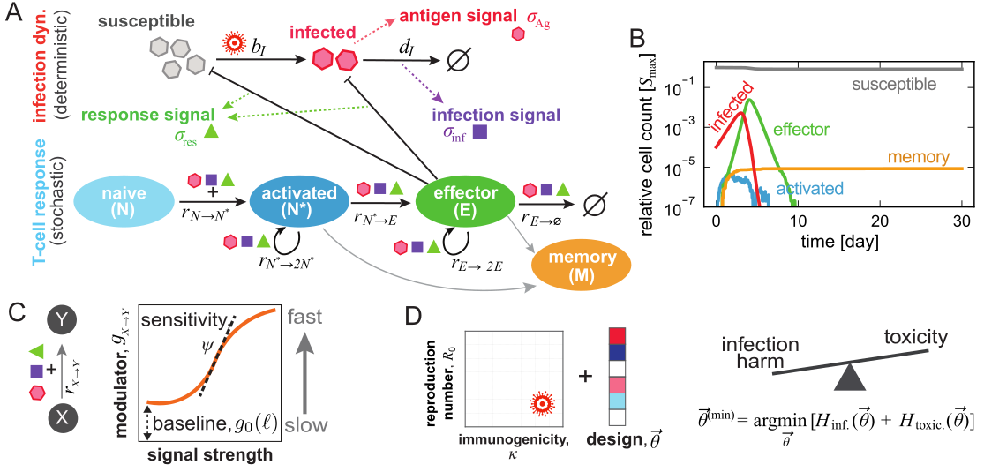

# designimmune: Design principles of the cytotoxic CD8+ T-cell response
Cytotoxic T lymphocytes eliminate infected or malignant cells, safeguarding surrounding tissues. Although experimental and systems-immunology studies have cataloged many molecular and cellular actors involved in an immune response, the design principles governing how the speed and magnitude of T-cell responses emerge from cellular decision-making remain elusive. Here, we recast T-cell response as a feedback-controlled program, wherein the rates of activation, proliferation, differentiation and death are regulated through antigenic, pro- and anti-inflammatory cues. By exploring a broad class of feedback-controller designs as potential immune programs, we demonstrate how the speed and magnitude of T-cell responses emerge from optimizing signal-feedback to protect against diverse infection settings. We recover an inherent trade-off: infection clearance at the cost of immunopathology. We show how this trade-off is encoded into the logic of T-cell responses by hierarchical sensitivity to different immune signals. Notably, we find the designs that balance the harm from acute infections and autoimmunity produce immune responses consistent with the experimentally observed patterns of T-cell effector expansion in mice. Extending our model to immune-based T-cell therapies for cancer tumors, we quantify the trade-off between the affinity for tumor antigens ("quality") and the abundance ("quantity") of infused T-cells necessary for effective treatment. Finally, we show how therapeutic efficacy can be improved by targeted genetic perturbations to T-cells. Our findings offer a unified control-logic for cytotoxic T-cell responses and point to specific regulatory programs that can be engineered for more robust T-cell therapies.

> Obinna Ukogu, University of Washington (oukogu@uw.edu)

This repository contains code and scripts in[^1] for running agent-based stochastic simulations of the CD8+ T cell response to varied immune challenges. The folder `scripts` contains a set of scripts for running parameter sweeps on a SLURM scheduler. The `notebooks` directory contains jupyter notebooks for analyzing the simulation results in Ukogu et al. (2025).

## References

[^1]: O. A. Ukogu, Z. Montague, G. Altan-Bonnet, A. Nourmohammad, Design principles of the cytotoxic CD8+ T-cell response, arXiv [physics.bio-ph] (2025). http://arxiv.org/abs/2509.22997.
  
